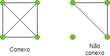
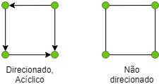
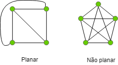
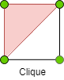
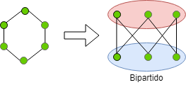

### [QUESTÃO – 02]
### Defina e dê exemplos:
#### A) Grafo
  - Um modelo de estrutura utilizado para representar relações entre pares de objetos.
  
#### B) Grafo conexo, acíclico e direcionado.
  - Grafo conexo: Uma estrutura em grafos onde existe um caminho entre qualquer par de vértice.  
  
    
  - Grafo acíclico: Uma estrutura em grafos que não possui ciclos.  
  
    
  - Grafo direcionado: Uma estrutura em grafos onde as relações entre os pares de objetos podem não ser simétricas.  
   
    
#### C) Adjacência x Vizinhança em grafos.
  - Adjacência: Dizemos que **v** é vizinho de **w** em uma relação não direcionada, neste caso, dizemos também que **v** é adjacente a **w**.   
    
  - Vizinhança: A relação de vizinhança não é simétrica. **V** pode ser vizinho de **w**, porém **w** pode não ser vizinho de **v**.  
    
    
#### D) Grafo planar.  
  - Uma estrutura em grafos onde não há intercessão entre as arestas.  
    
  
#### E) Grafo completo, clique e bipartido.  
  - Grafo completo: Uma estrutura em grafos onde qualquer vértice **v** é adjacente a qualquer vértice **w**.  
    
  
  - Clique: Em uma estrutura em grafos, um clique é um subgrafo onde obtém-se um grafo completo.  
    
  
  - Grafo bipartido: Um grafo onde os vértice podem ser separados em dois conjuntos disjuntos **U** e **V** onde toda aresta no conjunto **U** possui um correspondente em **V**.  
    
  
#### F) Grafo simples x multigrafo x digrafo.  
  - Grafo simples: Uma estrutura básica onde as relações entre os vértices são simétricas.  
    
  
  - Multigrafo: Uma estrutura onde os vértices **V** e **W** podem ter mais de uma relação.  
  
  
  - Dígrafo: Um grafo direcionado.  
    
  
