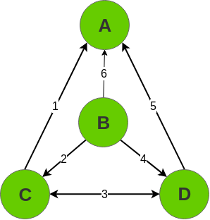

### [QUESTÃO – 03]  
### Defina e apresente exemplos de matriz de incidência, matriz de adjacência e lista de adjacência. Adicionalmente, descreva o impacto (vantagens e desvantagens) da utilização de matriz de adjacência e lista de adjacência.  
  

  - Matriz de incidencia: Um grafo G=(V,E) é representado por uma matriz **M**[**V**x**E**] onde sempre que um vértice **v** possuir como relação a areasta **e**, a matriz **M**[v,e]=1, senão **M**[v,e]=0.  

|  | 1 | 2 | 3 | 4 | 5 | 6 |
| :--: | :--: | :--: | :--: | :--: | :--: | :--: |
| **A** | 1 | 0 | 0 | 0 | 1 | 1 |
| **B** | 0 | 1 | 0 | 1 | 0 | 1 |
| **C** | 1 | 1 | 1 | 0 | 0 | 0 |
| **D**	| 0 | 0 | 1 | 1 | 1 | 0 |
  
  - Matriz de adjacência: Um grafo G=(V,E) é representado por uma matriz **M**[**V**x**W**] onde sempre que um vértice **v** possuir uma relação o vértice **w**, a matriz **M**[v,w]=1, senão **M**[v,w]=0.  

|  | **A** | **B** | **C** | **D** |
| :--: | :--: | :--: | :--: | :--: |
| **A** | 0 | 1 | 1 | 1 | 
| **B** | 1 | 0 | 1 | 1 | 
| **C** | 1 | 1 | 0 | 1 | 
| **D**	| 1 | 1 | 1 | 0 |
  
  - Lista de adjacência: Um grafo G=(V,E) é representado por uma matriz **M**[**V**x**W**] onde sempre que um vértice **v** possuir uma relação o vértice **w**, a matriz **M**[v,w]=1, senão **M**[v,w]=0.  
  
  
